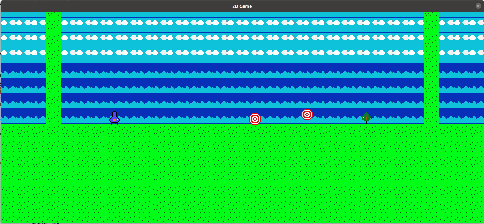

 

# Projectile Spam
A 2D, untraditional, pvp fighting game inspired by games like Divekick and Nidhogg. In this game, you play as a Mudkip or a Goblin shooting fireballs at eachother. 1 shot and it's over, so don't get hit!

### How to run
Import the project into eclipse. Then go to Main.java and run it from there. Or download the latest .jar file from the release and run it as an executable. The jar is also available on [itch.io](https://shobico8.itch.io/projectile-spam)

### Controls
<b>Mudkip:</b>

WASD to move

Move away from the enemy to block projectiles

F to fire a fireball

<b>Goblin:</b>

Arrow keys to move

Move away from the enemy to block projectile

Space to fire a fireball

<b>General:</b>

Esc to exit the game.

#### Credits
Basics made following this tutorial:
https://www.youtube.com/watch?v=om59cwR7psI

Style made consistent with the use of CheckStyle
https://checkstyle.sourceforge.io/

#### Special thanks
Dr. Elizabeth Matthews at Washington and Lee University for helping me with feedback and teaching me how to make games back in the Winter 2022 class Game Design.

Tommy's Arcade in Lexington, Virginia for getting me back into fighting games and heavily inspiring this game.
